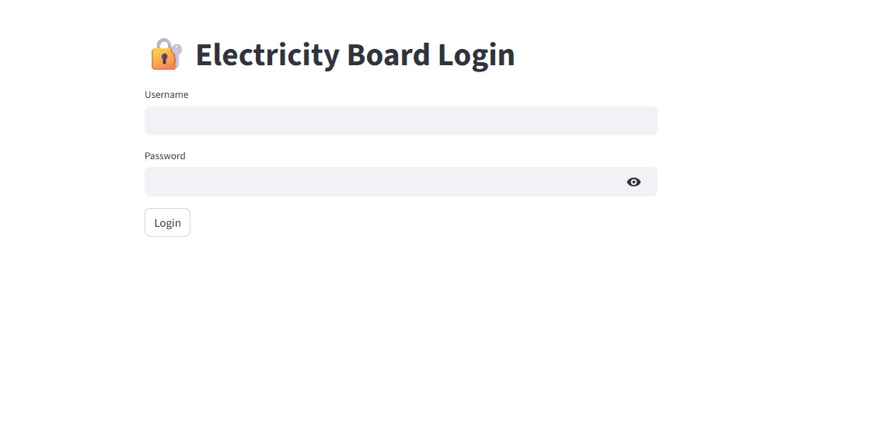
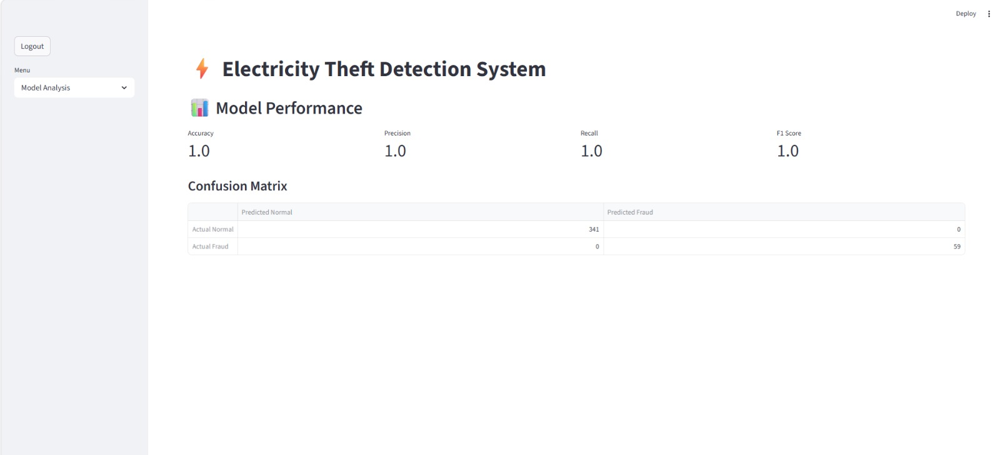
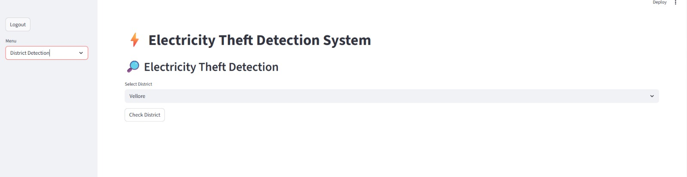
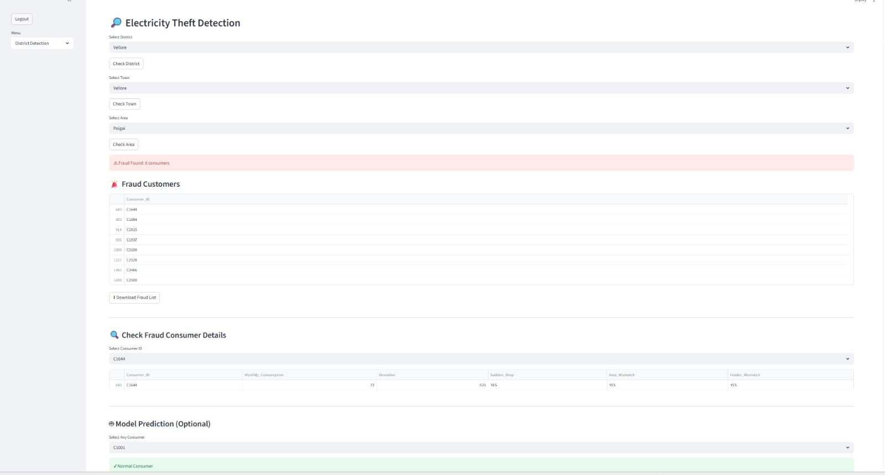

# ⚡ Electricity Theft Detection System

A Machine Learning-based web application that detects electricity theft using electricity consumption patterns. The system helps electricity board officers identify suspicious consumers through district-wise, town-wise, and area-wise analysis using a Random Forest Classifier and an interactive Streamlit dashboard.

---

## 📌 Overview

The Electricity Theft Detection System analyzes consumer electricity usage and predicts whether a consumer is normal or involved in electricity theft.

### Features

- 🔐 Secure Login Authentication
- 📊 Model Performance Analysis
- 🏙 District-wise Detection
- 🌍 Town-wise Detection
- 📍 Area-wise Detection
- 🚨 Fraud Consumer Identification
- 👤 Consumer Detail Analysis
- 🤖 Machine Learning Prediction
- 📥 Download Fraud Consumer Report

---

## 🛠 Technologies Used

- Python
- Streamlit
- Pandas
- Scikit-learn
- Random Forest Classifier
- Joblib

---

## 📂 Project Structure

```
Electricity-Theft-Detection/
│
├── app.py
├── train_model.py
├── README.md
├── requirements.txt
│
├── dataset/
│   └── electricity_data.csv
│
├── images/
│   ├── login_page.jpeg
│   ├── model_analysis.jpeg
│   ├── district_detection.jpeg
│   └── fraud_detection.jpeg
│
└── model/
    ├── model.pkl
    ├── scaler.pkl
    └── metrics.pkl
```

---

## 🤖 Machine Learning Model

**Algorithm:** Random Forest Classifier

### Input Features

- Monthly Consumption
- Average 6 Months Consumption
- Area Average
- Feeder Average
- Deviation
- Sudden Drop
- Area Mismatch
- Feeder Mismatch

### Target

- **0 → Normal Consumer**
- **1 → Electricity Theft**

---

## 📷 Screenshots

### 🔐 Login Page



### 📊 Model Performance



### 🔎 District Detection



### 🚨 Fraud Detection



---

## ▶️ Installation

### Clone the repository

```bash
git clone https://github.com/Devadharshini-007/Electricity-Theft-Detection.git
```

### Go to the project folder

```bash
cd Electricity-Theft-Detection
```

### Install dependencies

```bash
pip install -r requirements.txt
```

### Train the model

```bash
python train_model.py
```

### Run the application

```bash
streamlit run app.py
```

---

## 🔑 Login Credentials

### Admin

| Username | Password |
|------------|------------|
| admin | 1234 |

### Officer

| Username | Password |
|------------|------------|
| officer | 1234 |

---

## 📊 Model Performance

| Metric | Score |
|----------------|-------|
| Accuracy | 1.00 |
| Precision | 1.00 |
| Recall | 1.00 |
| F1 Score | 1.00 |

---

## 🔄 Workflow

```
Consumer Data
      │
      ▼
Data Preprocessing
      │
      ▼
Feature Engineering
      │
      ▼
Random Forest Classifier
      │
      ▼
Fraud Prediction
      │
      ▼
Streamlit Dashboard
      │
      ├── Login
      ├── Model Analysis
      ├── District Detection
      ├── Town Detection
      ├── Area Detection
      ├── Fraud Consumer List
      └── Consumer Prediction
```

---

## 🚀 Future Improvements

- Smart Meter Integration
- Real-time Monitoring
- GIS Map Visualization
- Email Notifications
- SMS Alerts
- Cloud Deployment
- Mobile Application

---

## 👩‍💻 Author

**R. Devadharshini**

B.Tech Artificial Intelligence and Data Science

GitHub:
https://github.com/Devadharshini-007

---

## ⭐ Support

If you found this project useful, please give it a ⭐ on GitHub.

---

## 📄 License

This project is developed for educational and academic purposes.